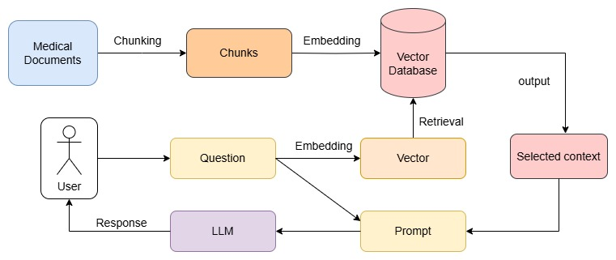
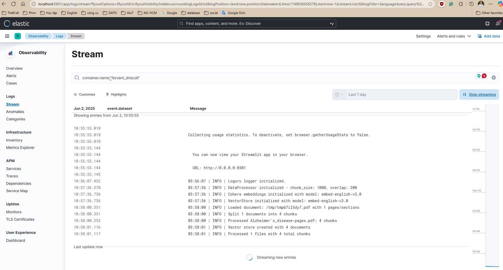

# Medical Assistant RAG System

A complete Retrieval-Augmented Generation (RAG) system that answers medical questions based on document corpus using [LangChain](https://python.langchain.com/docs/introduction), [FAISS](https://github.com/facebookresearch/faiss), and [Cohere](https://docs.cohere.com/cohere-documentation).

## 🚀 Live Demo

**Deployed URL**:
- [Streamlit Cloud](https://medicalassistant-luuthanhtung.streamlit.app/)
- [HuggingFace Space](https://huggingface.co/spaces/tuniel/medicalassistant-tungluu)

## Architecture

### Core Components
- **DocumentProcessor**: Handles file ingestion and text chunking
- **VectorStore**: Manages FAISS index and similarity search
- **RAGPipeline**: Orchestrates retrieval and generation
- **Logger**: Provides structured logging throughout the system

## 📋 Features

- **Document Ingestion**: Support for PDF and TXT files
- **Chunking**: text splitting with overlap
- **Vector Search**: FAISS-powered semantic retrieval
- **LLM Generation**: [Cohere LLM](https://docs.cohere.com/v2/docs/models) for accurate responses
- **Web Interface**: Clean Streamlit UI
- **Comprehensive Logging**: Query tracking and debug information
- **Source Attribution**: Shows retrieved document snippets

## 🛠️ Tech Stack

- **Backend**: Python, LangChain, FAISS, Cohere
- **LLM**: Cohere command-r-plus
- **Frontend**: Streamlit
- **Embeddings**: Cohere embed-english-v3.0
- **Deployment**: Streamlit Cloud / HuggingFace Spaces

## 📁 Project Structure

```
medical-rag-assistant/
medical_assistant/
├── app.py                          # Main Streamlit application
├── requirements.txt                # Dependencies (updated versions)
├── .env                            # Environment variables template
├── .gitignore
├── README.md
├── config/
│   ├── __init__.py
│   └── settings.py                # Configuration management
├── src/
│   ├── __init__.py
│   ├── components/               # RAG Components
│   │   ├── __init__.py
│   │   ├── data_loader.py       # Document loading component
│   │   ├── data_processor.py    # Text processing & chunking
│   │   ├── embedding.py         # Embedding generation
│   │   ├── vector_store.py      # Vector storage management
│   │   ├── retriever.py         # Information retrieval
│   │   └── generator.py         # Response generation
│   ├── core/
│   │   ├── __init__.py
│   │   └── rag_pipeline.py      # Orchestrates retrieval and generation
│   └── utils/
│       ├── __init__.py
│       ├── logger.py            # Logging utilities
│       └── helpers.py           # Helper functions
├── data/
│   ├── documents/               # Source documents
│   └── processed/              # Processed data cache
├── tests/                      # Unit test
│    ├── __init__.py
│    ├── test_components/
│    │   ├── test_data_loader.py
│    │   ├── test_data_processor.py
│    │   ├── test_embedding.py
│    │   ├── test_vector_store.py
│    │   ├── test_retriever.py
│    │   └── test_generator.py
│    └── test_integration/
│        └── test_rag_pipeline.py
└── logs/                       # Application logs
```

## 🚀 Quick Start

### 📋 Requirements

- Python 3.10
- [Cohere API key](https://docs.cohere.com/v2/docs/rate-limits) - [How to get it?](https://docs.aicontentlabs.com/articles/cohere-api-key/)

### 1. Clone the Repository

```bash
git clone https://github.com/yourusername/medical-rag-assistant.git
cd medical-rag-assistant
```

### 2.1. Run the Application on local

```bash
pip install -r requirements.txt
streamlit run app.py
```
### 2.2. OR Run the Application with docker

```bash
docker build -t streamlit-app .
docker run -p 8501:8501 streamlit-app
```

The app will be available at `http://localhost:8501`

## 🔧 Configuration
You can modify this in [`medical_assistant\config\settings.py`](config/settings.py)
### Document Processing
- **Chunk Size**: 1000 characters
- **Chunk Overlap**: 200 characters  
- **Retrieval**: Top 3 most relevant chunks

### LLM Settings
- **Model**: command-r-plus
- **Temperature**: 0.1 (for consistent medical responses)
- **Max Tokens**: 1000

## 📊 Logging

The system logs:
- Console logging is always enabled for real-time debugging.
- File logging can be enabled or disabled using the `enable_file_logging` flag in [settings](config/settings.py).
- User queries and timestamps
- Retrieved document chunks with scores
- LLM responses and processing times
- Error handling and debug information

Logs are stored in `logs/rag_system.log` with rotation.
### Logging Monitor 

Run ELK stack with `Filebeat`
```bash
cd /src/elk
docker compose -f elk-docker-compose.yml -f extensions/filebeat/filebeat-compose.yml up -d
```
Quickly run a container so that `Filebeat` can collect logs from it
```bash
docker run -p 8501:8501 streamlit-app
```
#### Access services
- Kibana: http://localhost:5601 with `username/password` is `elastic/changeme`



## 🧪 Sample Documents

The `data/sample_documents/` folder contains example medical documents:
- Subdocs Alzheimer's disease
- Subdocs beriberi desease

## 🎬 Video Demo
[](https://www.youtube.com/watch?v=ugD-2esz9-k)


